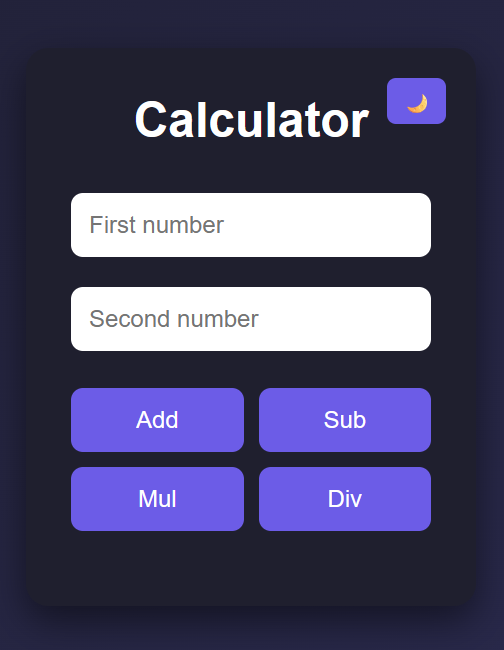

# 🧮 Calculator App

A simple full-stack calculator built using **HTML, CSS, JavaScript, and Node.js (Express)**.

## ✨ Features

* ➕ Add, ➖ Subtract, ✖️ Multiply, ➗ Divide
* ⚠️ Input validation (invalid numbers)
* ❌ Divide-by-zero handling
* 🌙 Dark / ☀️ Light mode toggle
* 🎨 Clean modern UI

## 📸 Screenshot



## 🚀 Run Locally

```bash
npm install
node index.js
```

Then open:

```
http://localhost:3000
```

## 📁 Project Structure

```
CALC_BACKEND/
│
├── public/
│   ├── index.html
│   ├── styles.css
│   └── screenshot.png
│
├── index.js
├── package.json
└── README.md
```

## 🛠️ Tech Stack

* Frontend: HTML, CSS, JavaScript
* Backend: Node.js, Express

## 📌 Notes

This project was built to practice full-stack basics:

* Client-server communication
* API handling
* UI/UX improvements

---

## 💡 Future Improvements

* Keyboard input support
* History of calculations
* Deploy online
